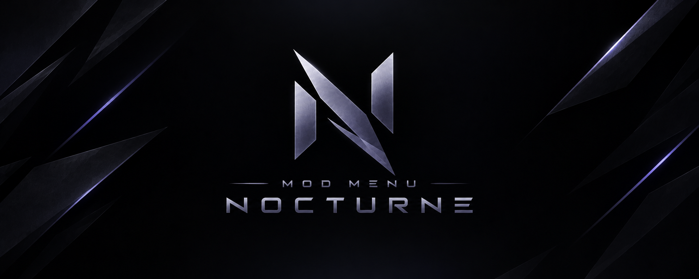

<div align="center">



<br><br>

# 🌙 Nocturne(onyx)

**A sleek, feature-packed mod menu for Among Us.**

Dark moonlit overlay · QoL & host tools · visuals & ESP · match review · a full built-in music player

<br>


<br>


<br><br>

<a href="https://discord.gg/cP4MrVUfM7"></a>

</div>

---

## ✨ Overview

**Nocturne** is a client-side **mod menu** built from the ground up for Among Us. A clean, dark **moonlit** overlay brings everything together — quality-of-life tweaks, deep theming, cosmetics, chat & lobby tools, and a proper **built-in music player** — in one tidy window. Open it with **`Insert`**, toggle what you like, and your settings stick between sessions.

- 🌙 **Moonlit dark theme** — rounded panels, smooth animations, an icon sidebar
- 🎨 **24 accent colors** — recolor the whole UI to taste
- 🌍 **Bilingual** — Russian / English, switchable in-game
- 🧩 **Modular** — every option is a toggle; enable only what you want
- 🗂 **Organized** — 9 tabs, collapsible sections and a built-in search

---

<div align="center">

### ⭐ Enjoying Nocturne(Onyx)?

If it makes your games nicer, **drop a star** — it helps others find the project and keeps it going!

[](https://github.com/Veltrix-s/OnyxMenu)

</div>

---

## 💬 Community

<div align="center">

**Join the Discord** — the best place for support, release updates and feedback.

[](https://discord.gg/cP4MrVUfM7)

</div>

---

## 📜 Releases

<div align="center">


<br><br>

**[⬇️ Download the latest release](https://github.com/Veltrix-s/OnyxMenu/releases/latest)** &nbsp;·&nbsp; **[📜 View all versions](https://github.com/Veltrix-s/OnyxMenu/releases)**

</div>

---


## 🧰 Features

<table>
<tr><td width="50%" valign="top">

### ⚡ Quality of Life
- FPS counter & lobby timer (in the ping tracker)
- Pop-up notifications (toasts)
- FPS lock / custom cap · HUD scale
- One-key **lobby code copy** (`F6`)
- 24 accent themes · collapsible sections + search

### 🏠 Lobby & Host
- Custom **lobby bar** (host avatar, START, FPS/ping/time chips)
- Unlock Start · start / instant-start on `Enter`
- **Auto-host** — min players, delays, force start, auto-return
- Rich lobby browser (host / code / platform / age)
- No win conditions · 4 impostors · custom seeker count in Hide & Seek
- Host rules — vote-immune · no reports & meetings · unlock option limits
- Fake map · destroy / rebuild the lobby object
- **Lobby clones** — spawn, formations, text-art, shadow / guard / drift

### ⚔️ Match Tools
- Instant kill — all / crewmates / impostors · telekill
- Auto-vent after kill · body to vent · vent network
- Multi-sabotage · blind / full-bright · classic mode
- Role buffs — no cooldowns, reach, walk in vents…

### 🎵 Music Player
- Opens with **`M`** — plays from `plugins/Nocturne/Music/`
- Full DSP chain: 10-band EQ (28 presets), stereo widening, bass, loudness, de-esser, crossfade, crossfeed, saturation, limiter
- Live FFT spectrum & disc visualizer

</td><td width="50%" valign="top">

### 👁 Visuals & ESP
- Roles / ghosts / vents / boxes / tracers · full-bright · wallhack
- Free camera · wheel zoom · no-clip
- **Task arrows** · **radar minimap** (players / bodies / vents)
- Skip Shhh / role reveal / kill animations
- Unlock & preview cosmetics · favorite outfits

### 🎬 Match Review
- Record & replay the round — paths, kills, vents, sabotages, meetings
- Smooth timeline scrubbing + playback, per-player focus, filters

### 🧑 Players
- Reveal roles · info above names (level / platform)
- Show meeting votes · morph · follow / teleport
- **Self-drag** — move yourself with LMB
- Colored name · fun pranks (eggs, morph, rainbow…)

### 💬 Chat
- Draggable chat window · timestamps · dark theme · symbol picker
- No length limit · quick chat presets
- Chat commands · color commands `/c /color`

### 🛡 Guard
- Ban list / whitelist by FriendCode
- Nick ban & name history · level guard
- Reserve player colors (host)

### 🌐 Spoof & Network
- Live ping / FPS / lobby status
- Spoof platform · displayed level · friend code · device ID

### 🔐 Privacy
- Block analytics, crash & performance reporting

</td></tr>
</table>

---

## ⌨️ Hotkeys

| Key | Action | | Key | Action |
|:---:|:-------|---|:---:|:-------|
| `Insert` | Open / close the menu | | `M` | Open the music player |
| `F6` | Copy the lobby code | | `[` / `]` | Previous / next track |
| `Esc` | Close the menu | | | |

> All keys are rebindable in **Settings → Hotkeys**.

---

## 📦 Installation

> Nocturne runs on **BepInEx 6 (IL2CPP)**.

### 1 · Install BepInEx
Grab the **IL2CPP** build that matches your game's architecture:

| Channel | Link |
| --- | --- |
| **Stable** | https://github.com/BepInEx/BepInEx/releases |
| **Bleeding Edge** | https://builds.bepinex.dev/projects/bepinex_be |

### 2 · Set up BepInEx
Extract the archive into your **Among Us** folder — the one containing `Among Us.exe` and `GameAssembly.dll`:

```text
Among Us/
├─ Among Us.exe
├─ GameAssembly.dll
├─ winhttp.dll
├─ dotnet/
└─ BepInEx/
```

Launch the game once, reach the main menu, then close it — this generates the **`BepInEx/plugins`** folder.

### 3 · Install Nocturne
Download **`NocturneMenu.dll`** from the [**latest release**](#) and drop it into:

```text
Among Us/BepInEx/plugins/NocturneMenu.dll
```

Launch the game and press **`Insert`** to open the menu.

### 🐧 Linux / Steam Deck
Install BepInEx and Nocturne as above, then add this to your Steam **launch options**:

```bash
WINEDLLOVERRIDES="winhttp.dll=n,b" %command%
```

### 🎵 Adding music
Drop `.mp3` / `.wav` / `.ogg` / `.flac` files into `Among Us/BepInEx/plugins/Nocturne/Music/`, then open the player with **`M`**.

---

## ⚠️ Disclaimer

Nocturne is an unofficial third-party modification for Among Us.

The project is not affiliated with, endorsed by, sponsored by or approved by Innersloth LLC. Among Us and its related trademarks and assets belong to their respective owners.

Nocturne is intended for use in **private lobbies only**.

The software is provided **as-is**, without any warranty.

By installing or using Nocturne, you accept full responsibility for how you use it and for any consequences that may result, including account restrictions, bans, kicks, crashes, lost progress, corrupted files, game instability or incompatibility with future updates.

The developer is **not responsible for any consequences, damage or misuse resulting from the use of this software**.

Support is not provided for harassment, disruption of public games, unauthorized access, moderation evasion or other malicious activity.

For the best experience, disable or remove other mods before launching to avoid crashes and conflicts.

> **This mod is not affiliated with Among Us or Innersloth LLC, and the content contained therein is not endorsed or otherwise sponsored by Innersloth LLC. Portions of the materials contained herein are property of Innersloth LLC. © Innersloth LLC.**

---

## 📄 License

Released under the **[GNU GPL v3.0](LICENSE)**. You are free to use, study, share and modify Nocturne, provided derivative works remain under the same license.

---

## 🙏 Credits & Acknowledgements

**Nocturne** is an independent, client-side mod menu written from scratch in C#.
The Among Us modding community is a shared space, and the projects below were
valuable references for feature ideas and concepts. Much respect to their authors. 🖤

### Inspiration & References

| Project | |
| :-- | :-- |
| **[MalumMenu](https://github.com/scp222thj/MalumMenu)** | Feature & concept inspiration |
| **[SickoMenu](https://github.com/g0aty/SickoMenu)** | Feature & concept inspiration *(native C++ menu)* |
| **[Hydra](https://github.com/MrDiamond64/Hydra)** | Feature & concept inspiration |
| **[ElysiumModMenu](https://github.com/Wextikit/ElysiumModMenu)** | Feature & concept inspiration |

---

<div align="center">

Made with 🌙 by **Kawasaki**

[**Join the Discord →**](https://discord.gg/cP4MrVUfM7)

</div>
